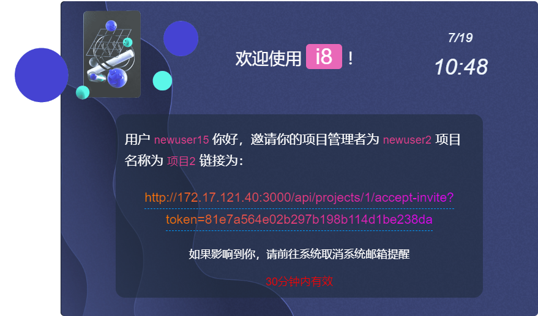

# 项目管理系统v1.0

此系统用于管理项目文件，将与分析平台进行对接

### 功能点：

- 大文件分片上传的雏形算法，为分片进行md5增量计算确认是否为同一文件
- 电子邮件邀请、注册模块

### 想法：

- 项目成员管理（升权限、删除、不允许操作）
- 数据分析请求时间过长，启用多线程
- 对于请求的图片进行降低图片质量操作
- 请求时间过长启动请求取消
- 建立模型，检测用户异常行为赋予用户每天分析次数。如果异常行为过多减少次数并建立信任机制
